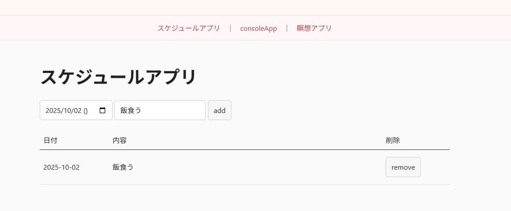
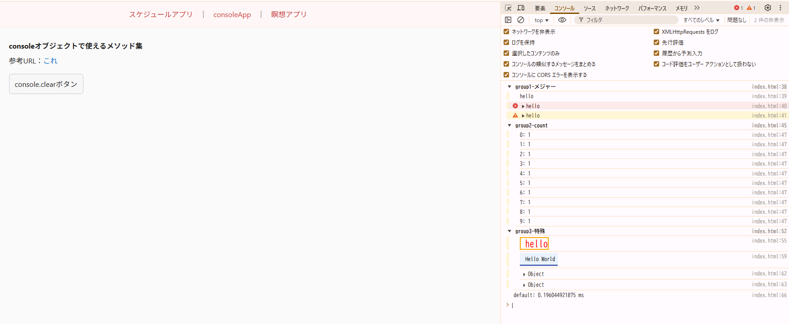
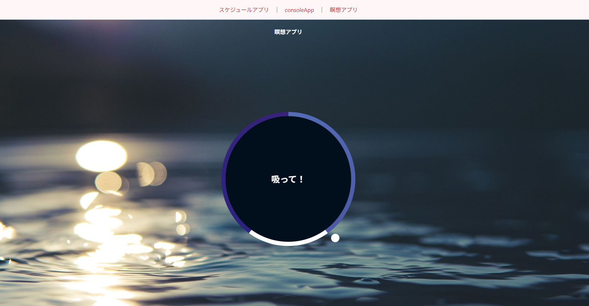

# JavaScript-Junk-App

[English](./docs/lang/en.md) | 日本語

休学中に作成した JavaScript のコードを記録する

## 機能紹介

- スケジュールアプリ
- 様々な console オブジェクトアプリ
- 瞑想アプリ

## 実装UI(2025.10.01)





## セットアップ手順

1. 前提

   - Node.js (推奨: 18 以上)
   - パッケージマネージャ: pnpm もしくは npm

2. 取得

   - GitHub から取得する場合
     ```bash
     git clone git@github.com:Kazu-K0032/JavaScript-Junk-App.git
     cd JavaScript-Junk-App
     ```

3. 依存関係のインストール

   - pnpm を使う場合
     ```bash
     pnpm install
     ```
   - npm を使う場合
     ```bash
     npm ci
     ```

4. ローカルサーバー起動

   - pnpm を使う場合
     ```bash
     pnpm serve
     ```
   - npm を使う場合
     ```bash
     npm run serve
     ```

5. アクセス
   - ブラウザで `http://localhost:5173` を開く

補足

- 既に 5173 番ポートを使っている場合は、次のように別ポートで起動できます。
  ```bash
  npx http-server -c-1 -p 5180 .
  ```
  その場合は `http://localhost:5180` にアクセスしてください。
