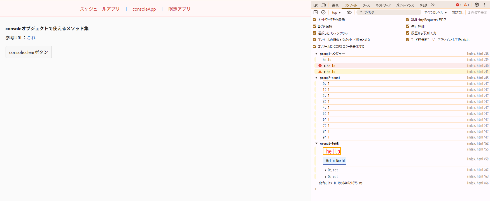
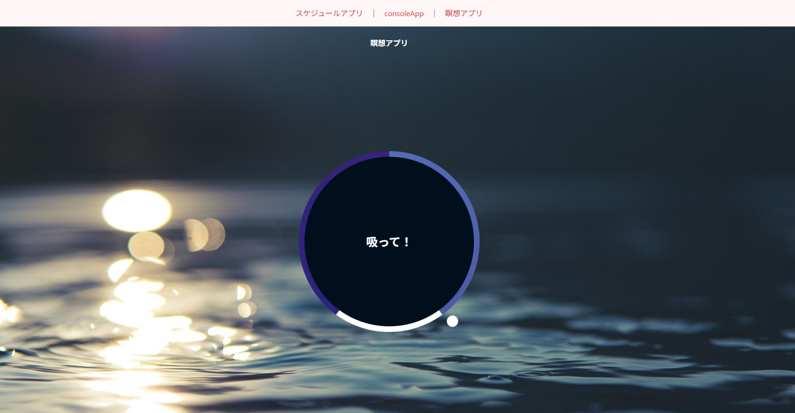

# JavaScript-Junk-App

[日本語](../../README.md) | English

Record JavaScript code created during my leave of absence.

## Features

- Schedule app
- Various console object apps
- Meditation app

## Implemented UI (2025-10-01)





## Setup

1. Prerequisites

   - Node.js (recommended: 18 or later)
   - Package manager: pnpm or npm

2. Get the source

   - From GitHub
     ```bash
     git clone git@github.com:Kazu-K0032/JavaScript-Junk-App.git
     cd JavaScript-Junk-App
     ```

3. Install dependencies

   - Using pnpm
     ```bash
     pnpm install
     ```
   - Using npm
     ```bash
     npm ci
     ```

4. Start local server

   - Using pnpm
     ```bash
     pnpm serve
     ```
   - Using npm
     ```bash
     npm run serve
     ```

5. Access
   - Open `http://localhost:5173` in your browser

Notes

- If port 5173 is already in use, start the server on another port:
  ```bash
  npx http-server -c-1 -p 5180 .
  ```
  Then open `http://localhost:5180`.
